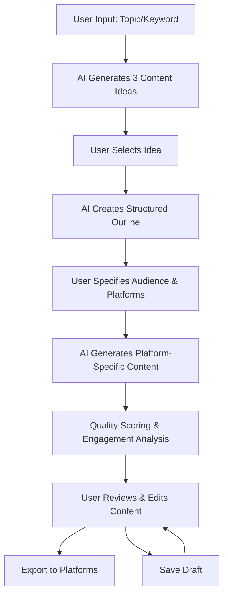

# Design Document

## Overview

ContentFlow AI is designed as a modular, AI-powered content creation system that transforms single content ideas into platform-optimized, audience-personalized content. The architecture prioritizes simplicity and rapid development while maintaining scalability for future enhancements.

## Architecture Overview

### Frontend
- **Single Page Application (SPA)**: React-based interface providing seamless user experience
- **Component Structure**: Modular components for idea input, content generation, editing, and export
- **State Management**: Context API for managing content workflow state
- **Responsive Design**: Mobile-first approach for accessibility across devices

### Backend
- **API Gateway**: Express.js server handling all client requests
- **Content Processing Pipeline**: Orchestrates AI services and data flow
- **Session Management**: Temporary storage for user workflows and content drafts
- **Export Service**: Handles content formatting and delivery

### AI Engine
- **LLM Integration**: OpenAI GPT-4 or similar for content generation
- **Prompt Engineering**: Specialized prompts for each content type and platform
- **Quality Assessment**: Rule-based scoring combined with AI evaluation
- **Engagement Analysis**: Pattern matching and trend analysis algorithms

## User Flow Description



1. **Idea Generation**: User inputs topic/keyword, system generates 3 distinct content ideas
2. **Outline Creation**: User selects preferred idea, system creates structured outline
3. **Audience Configuration**: User specifies target audience and desired platforms
4. **Content Generation**: System generates platform-specific versions (LinkedIn, Instagram, Blog)
5. **Quality Assessment**: System provides quality scores and engagement suggestions
6. **Review & Edit**: User can modify generated content
7. **Export**: User downloads or copies content for publishing

## Component Breakdown

### Frontend Components

#### IdeaInputComponent
- Handles initial topic/keyword input
- Displays generated content ideas
- Manages idea selection workflow

#### OutlineComponent
- Shows structured content outline
- Allows outline editing and refinement
- Triggers platform-specific generation

#### AudienceConfigComponent
- Audience demographic input
- Platform selection interface
- Tone and style preferences

#### ContentDisplayComponent
- Side-by-side platform content comparison
- Real-time editing capabilities
- Quality scores and suggestions display

#### ExportComponent
- Platform-specific formatting preview
- Copy-to-clipboard functionality
- Download options for different formats

### Backend Services

#### ContentGenerationService
- Orchestrates AI content creation pipeline
- Manages prompt templates and context
- Handles content versioning and iterations

#### QualityAssessmentService
- Evaluates content quality using multiple criteria
- Provides actionable improvement suggestions
- Calculates engagement prediction scores

#### PlatformAdapterService
- Applies platform-specific formatting rules
- Manages character limits and constraints
- Optimizes hashtags and keywords

#### SessionService
- Manages user workflow state
- Handles content draft persistence
- Provides session recovery capabilities

## AI Workflow and Prompt Strategy

### Content Idea Generation
```
Prompt Template:
"Generate 3 distinct, engaging content ideas for the topic: {topic}
Consider current trends and audience appeal.
Format: Title, Brief Description, Key Angle"
```

### Outline Creation
```
Prompt Template:
"Create a structured outline for: {selected_idea}
Include: Hook, Main Points (3-5), Call to Action
Target audience: {audience_type}"
```

### Platform-Specific Generation

#### LinkedIn Content
```
Prompt Template:
"Transform this outline into LinkedIn content:
{outline}
Requirements: Professional tone, 1300 char limit, 3-5 hashtags
Include: Industry insights, actionable takeaways"
```

#### Instagram Content
```
Prompt Template:
"Create Instagram content from:
{outline}
Requirements: Engaging caption, visual descriptions, 2200 char limit
Include: Emojis, 5-10 hashtags, story potential"
```

#### Blog Content
```
Prompt Template:
"Develop blog post from outline:
{outline}
Requirements: SEO-optimized, 800-1200 words, clear structure
Include: Introduction, body sections, conclusion, meta description"
```

### Quality Scoring Algorithm
- **Clarity Score** (25%): Readability, structure, coherence
- **Engagement Potential** (30%): Hook strength, call-to-action effectiveness
- **Platform Optimization** (25%): Format compliance, best practices
- **Originality** (20%): Uniqueness, fresh perspective

## Data Models

### ContentIdea
```typescript
interface ContentIdea {
  id: string;
  title: string;
  description: string;
  angle: string;
  createdAt: Date;
}
```

### ContentOutline
```typescript
interface ContentOutline {
  id: string;
  ideaId: string;
  hook: string;
  mainPoints: string[];
  callToAction: string;
  targetAudience: AudienceProfile;
}
```

### PlatformContent
```typescript
interface PlatformContent {
  id: string;
  outlineId: string;
  platform: 'linkedin' | 'instagram' | 'blog';
  content: string;
  hashtags: string[];
  qualityScore: QualityScore;
  engagementSuggestions: string[];
}
```

### QualityScore
```typescript
interface QualityScore {
  overall: number; // 1-100
  clarity: number;
  engagement: number;
  platformOptimization: number;
  originality: number;
  explanation: string;
  improvements: string[];
}
```

## Data Flow Explanation

1. **Input Processing**: User input captured and validated on frontend
2. **AI Request Formation**: Backend constructs appropriate prompts with context
3. **LLM Communication**: Secure API calls to AI service with rate limiting
4. **Response Processing**: AI responses parsed and structured into data models
5. **Quality Analysis**: Generated content evaluated using scoring algorithms
6. **State Management**: Content and scores stored in session for user interaction
7. **Export Preparation**: Final content formatted according to platform requirements

## Technology Stack

### Frontend
- **Framework**: React 18 with TypeScript
- **Styling**: Tailwind CSS for rapid UI development
- **State Management**: React Context API
- **HTTP Client**: Axios for API communication
- **Build Tool**: Vite for fast development and building

### Backend
- **Runtime**: Node.js with Express.js
- **Language**: TypeScript for type safety
- **AI Integration**: OpenAI API or Anthropic Claude
- **Session Storage**: Redis for temporary data
- **Environment**: Docker for containerization

### Development Tools
- **Version Control**: Git with conventional commits
- **Code Quality**: ESLint, Prettier
- **Testing**: Jest for unit tests, Cypress for E2E
- **Deployment**: Vercel (frontend), Railway (backend)

## Security Considerations

### Data Protection
- **Encryption**: TLS 1.3 for data in transit
- **API Security**: Rate limiting and request validation
- **Session Security**: Secure session tokens with expiration
- **Input Sanitization**: Prevent injection attacks

### Privacy Measures
- **Data Minimization**: Store only necessary user data
- **Temporary Storage**: Content automatically deleted after 24 hours
- **No Training Data**: User content excluded from AI model training
- **Compliance**: GDPR and CCPA compliant data handling

### AI Safety
- **Content Filtering**: Prevent generation of harmful content
- **Rate Limiting**: Prevent API abuse and cost control
- **Error Handling**: Graceful degradation for AI service failures
- **Audit Logging**: Track AI usage for monitoring and debugging

## Future Enhancements

### Phase 2 Features
- **Multi-language Support**: Content generation in multiple languages
- **Brand Voice Training**: Custom AI models for consistent brand voice
- **Analytics Integration**: Performance tracking across platforms
- **Collaboration Tools**: Team workflows and approval processes

### Phase 3 Features
- **Advanced Personalization**: ML-based audience segmentation
- **Content Calendar**: Automated scheduling and publishing
- **Performance Optimization**: A/B testing for content variations
- **Integration Ecosystem**: Direct publishing to social platforms

### Technical Improvements
- **Caching Layer**: Redis caching for improved performance
- **Microservices**: Service decomposition for better scalability
- **Real-time Updates**: WebSocket integration for live collaboration
- **Advanced Analytics**: User behavior tracking and optimization